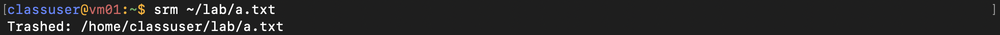
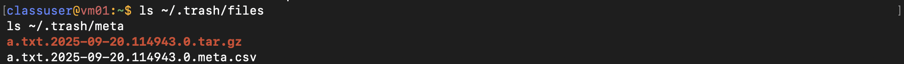
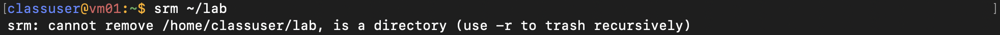
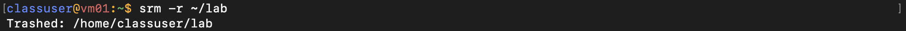
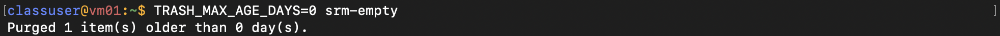
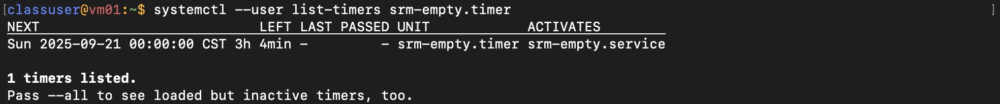

# HW1 Report

## 1. 系統設定步驟

1. **建立目錄**

   ```bash
   mkdir -p ~/bin ~/.trash/{files,meta} ~/.config/systemd/user
   ```
2. **安裝指令**
   將三個腳本存入 `~/bin/`，並賦予執行權限：

   ```bash
   chmod +x ~/bin/srm ~/bin/srm-restore ~/bin/srm-empty
   ```
3. **加入 PATH 並重新載入**

   ```bash
   export PATH="$HOME/bin:$PATH"
   source ~/.bashrc
   ```
4. **設定 systemd 計時器**
   建立 `~/.config/systemd/user/srm-empty.service`：

   ```ini
   [Unit]
   Description=Smart Trash Can - purge old items

   [Service]
   Type=oneshot
   ExecStart=%h/bin/srm-empty
   Environment=TRASH_MAX_AGE_DAYS=7
   ```

   建立 `~/.config/systemd/user/srm-empty.timer`：

   ```ini
   [Unit]
   Description=Run srm-empty daily

   [Timer]
   OnCalendar=*-*-* 00:00:00
   Persistent=true

   [Install]
   WantedBy=timers.target
   ```

   啟用與立即啟動：

   ```bash
   systemctl --user daemon-reload
   systemctl --user enable --now srm-empty.timer
   systemctl --user list-timers srm-empty.timer
   ```

## 2. 功能示範

### 2.1 刪除檔案

```bash
$ srm ~/lab/a.txt
```



垃圾桶內會生成：



```bash
$ srm ~/lab
```

系統會提示要加上 flag：



```bash
$ srm -r ~/lab
```



### 2.2 還原檔案

```bash
$ srm-restore
```


### 2.3 自動/手動清空

手動立即清空：

```bash
$ TRASH_MAX_AGE_DAYS=0 srm-empty
```



檢查 systemd 計時器：

```bash
$ systemctl --user list-timers srm-empty.timer
```


